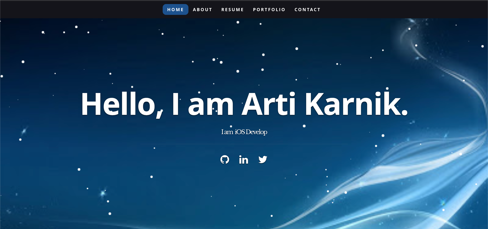

# Portfolio-React
# React-Portfolio

 [React-Portfolio](#React-Portfolio)
    - [Table of Contents](#table-of-contents)
  * [Summary](#summary)
  * [Pre-requisite](#pre-requisite)
  * [Demo](#demo)
  * [Technologyused](#technologyused-)
  * [Install](#install-)
  * [Contributor](#contributor)
  * [Codebase](#codebase)
  * [Application Walk-through](#Application-walk-through)

## Summary
  Creating a portfolio using React will help set you apart from other developers whose portfolios do not use some of the latest technologies.

## Pre-requisite
Install NodeJS 

## Demo

## Technologyused:
<ul>
    <li> 
    <a href="https://reactjs.org/docs/getting-started.html" target="_blank">ReactJS  <a>
     
    </li>
    <li> 
    <a href="https://nodejs.org/en/docs/" target="_blank">NodeJS <a>
</ul>

## Install:
<strong>Code installation:</strong>  
$ cd [path_to_save_codebase]  
$ git clone https://github.com/arti-karnik/Portfolio-React 

<strong> Run the application: </strong>  
Open Terminal  
$ npm install  
$ npm start  
 
## Contributor
<strong> Github Profile: </strong>  
https://github.com/arti-karnik

<strong> Portfolio: </strong>  
https://arti-karnik.github.io/Portfolio-React/

## Codebase
https://github.com/arti-karnik/Technology-StopAndBlog

## Application Walk-through
<a href="https://arti-karnik.github.io/Portfolio-React/" target="_blank"> Click here for Application Live url </a>

